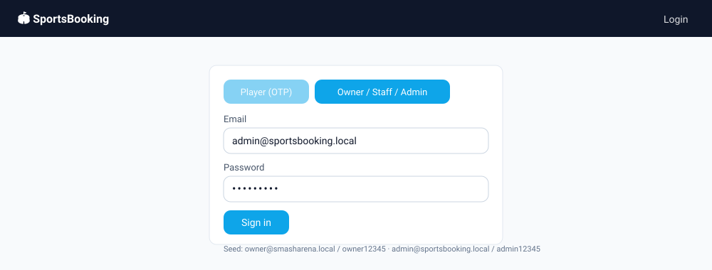
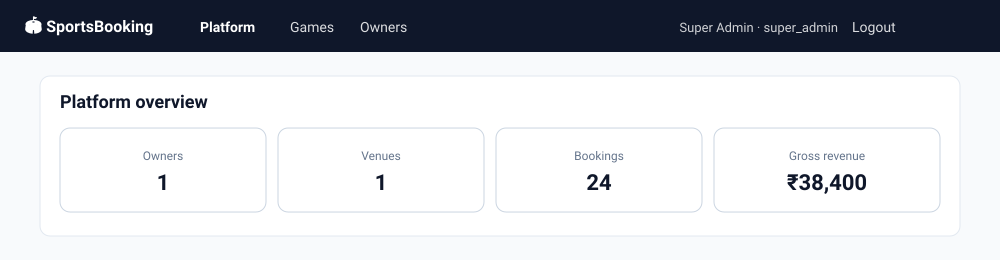
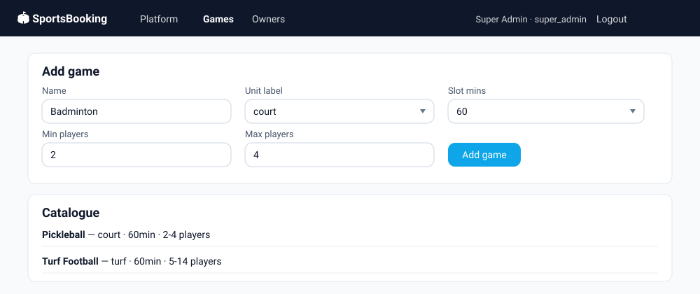
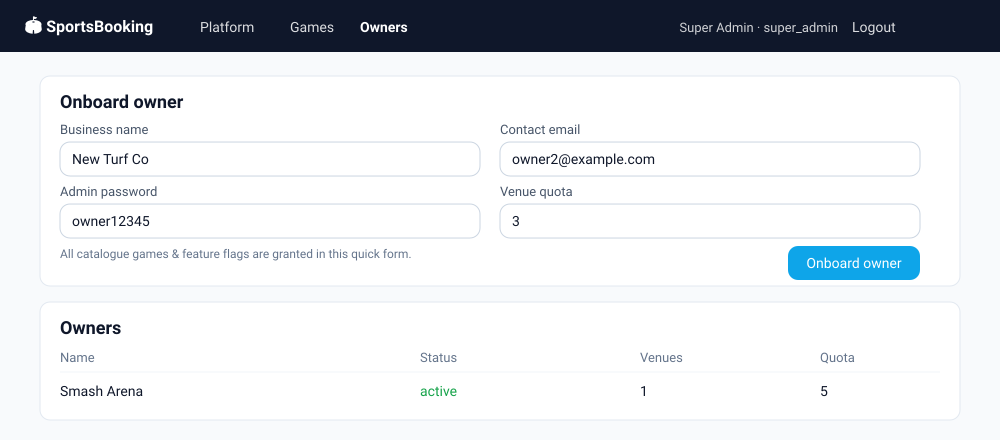

# Admin User Guide — SportsBooking

This guide covers the **Super Admin** console of the SportsBooking platform: the
controls a platform operator uses to run the catalogue of games, onboard venue
owners (tenants), and monitor platform-wide activity. It maps to PRD §3
(*Super Admin*).

> **Who this is for:** the platform operator who runs SportsBooking as a SaaS,
> **not** an individual venue owner. Owners manage their own venues, pricing,
> packs and players from the separate **Owner console** (see the *Owner* nav).

---

## 1. Roles at a glance

SportsBooking is multi-tenant. Each role sees a different navigation bar and set
of pages:

| Role | Signs in with | Can do |
|------|---------------|--------|
| **Super Admin** | email + password | Game catalogue, onboard & oversee owners, platform report |
| **Owner / Staff** | email + password | Venues, courts, pricing, packs, offers, players, tournaments |
| **Customer (Player)** | mobile + OTP | Browse & book, wallet, tournaments, account |

This guide documents the **Super Admin** surface only. The Super Admin
navigation has three pages: **Platform**, **Games**, and **Owners**.

---

## 2. Signing in

Open the app and choose the **Owner / Staff / Admin** tab on the login card, then
sign in with your Super Admin email and password.

- **Default seed credentials (dev):** `admin@sportsbooking.local` / `admin12345`.
- After sign-in you land on the **Platform** overview.
- Use **Logout** (top-right of the nav) to end the session. The session token is
  held in the browser; logging out clears it.

> 🔒 Change the seeded admin password before any non-local deployment.

---

## 3. Platform overview

The landing page after login. It shows live, platform-wide aggregates rolled up
across **every** owner/tenant (PRD §3.3).

| Tile | Meaning |
|------|---------|
| **Owners** | Total owner accounts provisioned on the platform |
| **Venues** | Total venues across all owners |
| **Bookings** | Total bookings made across the platform |
| **Gross revenue** | Sum of settled booking revenue across all tenants (₹) |

These figures refresh on each visit. Use this page as your at-a-glance health
check for platform growth and activity.

---

## 4. Game catalogue

The **Games** page defines the *global* catalogue of sports that owners can then
offer at their venues (PRD §3.1). A game is the template that determines how its
courts behave — what a bookable unit is called, how long a slot is, and the
valid player range.

### Add a game

Fill the **Add game** form and press **Add game**:

| Field | What it controls | Example |
|-------|------------------|---------|
| **Name** | Display name of the sport | `Badminton` |
| **Unit label** | What one bookable unit is called: `court`, `turf`, `lane`, or `net` | `court` |
| **Slot mins** | Slot granularity in minutes: `30`, `60`, or `90` | `60` |
| **Min players** | Minimum players for the game | `2` |
| **Max players** | Maximum players for the game | `4` |

On success you'll see **"Game added."** and the new game appears immediately in
the **Catalogue** list below. The catalogue is shared platform-wide — every owner
can be granted any of these games during onboarding.

> The seeded catalogue ships with **Pickleball** (court · 60min · 2–4) and
> **Turf Football** (turf · 60min · 5–14).

---

## 5. Onboard & oversee owners

The **Owners** page is where you bring new venue businesses onto the platform and
monitor existing ones (PRD §3.2, §3.3).

### Onboard an owner

Complete the **Onboard owner** form and press **Onboard owner**:

| Field | What it does |
|-------|--------------|
| **Business name** | The owner/tenant's display name |
| **Contact email** | Becomes the owner-admin **login email** |
| **Admin password** | The owner-admin's initial password |
| **Venue quota** | Max number of venues this owner may create |

This quick form grants **all catalogue games and all feature flags** to the new
owner. On success a confirmation shows the new owner's login, e.g.
*"Owner onboarded — login owner2@example.com / owner12345"*. Share those
credentials with the owner; they sign in via the same **Owner / Staff / Admin**
tab.

Behind the scenes this creates the tenant, provisions its owner-admin user, and
sets the account to **active** so they can start immediately.

### Feature flags granted

Onboarding via this form enables every per-account feature toggle (PRD §2.2):

- `tournaments` — run tournaments
- `memberships` — sell session packs
- `loyalty` — earn/redeem loyalty points
- `open_matches` — host open matches
- `addons` — sell rentals / café / coaching add-ons

### Oversee owners

The **Owners** table lists every account with live oversight columns:

| Column | Meaning |
|--------|---------|
| **Name** | Business name |
| **Status** | `active`, `suspended`, or `pending` |
| **Venues** | Venues created so far |
| **Quota** | Maximum venues allowed |

Use **Venues vs Quota** to spot owners approaching their cap. The newest owners
appear at the top.

### AMC renewal reminders & auto-suspend

The platform runs a daily **AMC (annual maintenance contract)** sweep (PRD §3.2):
owners whose `amcRenewalDate` falls within the next 7 days get a renewal reminder
(WhatsApp + SMS via the notification adapter), and owners more than 7 days overdue
are **auto-suspended**.

- **Run now:** the **Owners** page has a **Run AMC check** button that triggers
  the sweep on demand (`POST /api/super-admin/amc/run`) and reports how many
  owners were reminded / suspended.
- **Safety:** auto-suspension only mutates data when the API runs with
  `NODE_ENV=production`. In dev/local it is a **dry-run** — it logs which owners
  *would* be suspended but changes nothing, so the seeded demo owner survives
  local testing.
- Suspended owners can be set back to **active** with the status control above.

> Reminder delivery depends on a configured notification gateway
> (`NOTIFICATION_DRIVER=live` + `SMS_API_URL` / `WHATSAPP_API_URL`); with the
> default `log` driver the messages are only logged to the API console.

---

## 6. Common tasks — quick reference

| I want to… | Go to | Action |
|------------|-------|--------|
| Check platform growth | **Platform** | Read the four aggregate tiles |
| Add a new sport everyone can offer | **Games** | Fill *Add game* → **Add game** |
| Bring a new venue business online | **Owners** | Fill *Onboard owner* → **Onboard owner** |
| See an owner's venue usage vs cap | **Owners** | Read the *Venues* / *Quota* columns |
| Send AMC reminders / suspend lapsed owners | **Owners** | **Run AMC check** |
| Change your admin password | Account/profile | Use **change password** (`POST /api/auth/password`) |
| End your session | Any page | **Logout** (top-right) — revokes the refresh token |

---

## 7. Appendix — API endpoints behind the console

For automation or integration, the Super Admin console calls these REST endpoints
(JWT-authenticated as a Super Admin):

| Action | Method & path |
|--------|---------------|
| List games | `GET /api/super-admin/games` |
| Create game | `POST /api/super-admin/games` |
| Update game | `PATCH /api/super-admin/games/:id` |
| List owners | `GET /api/super-admin/owners` |
| Onboard owner | `POST /api/super-admin/owners` |
| Update owner status | `PATCH /api/super-admin/owners/:id/status/:status` (validated against the status enum) |
| Run AMC reminder/suspend sweep | `POST /api/super-admin/amc/run` |
| Platform report | `GET /api/reports/platform` |
| Change own password | `POST /api/auth/password` |
| Log out (revoke refresh token) | `POST /api/auth/logout` |

---

### About the snapshots

The screens above are vector snapshots rendered from the app's actual markup,
CSS tokens (`apps/web/src/styles.css`) and seed data, so they stay crisp at any
zoom and track the real UI. To regenerate them from a running stack instead,
boot the app (`pnpm dev`) and capture the `/admin`, `/admin/games`, and
`/admin/owners` routes after signing in as the Super Admin.
